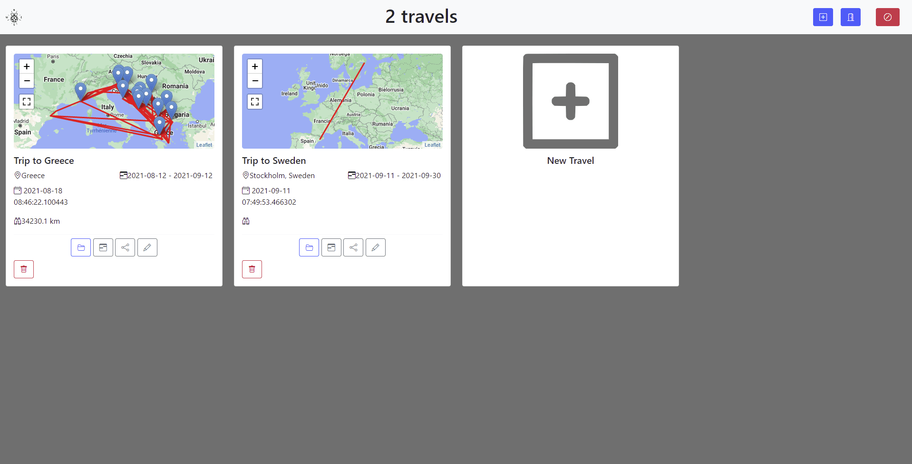
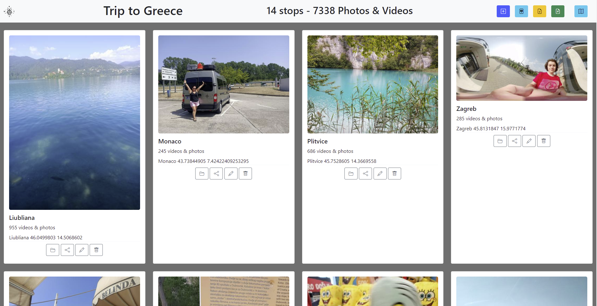
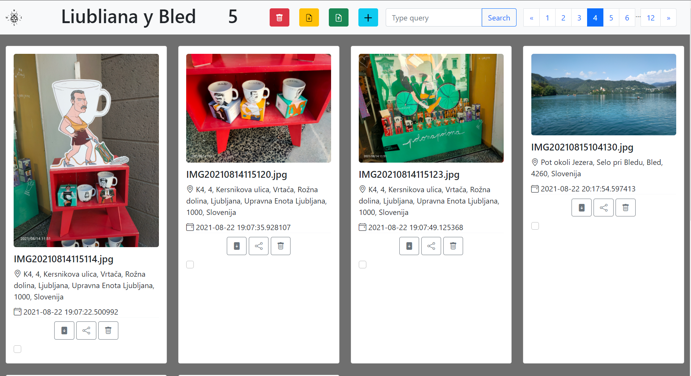
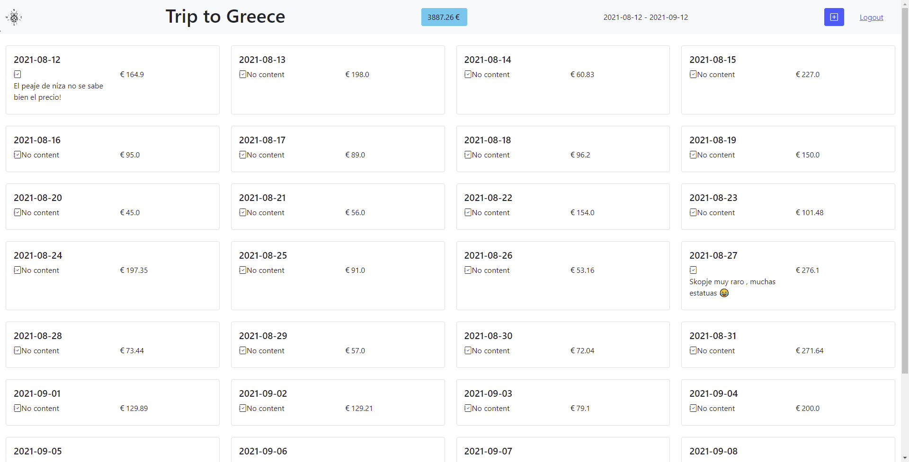
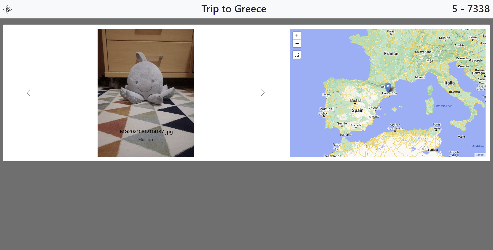
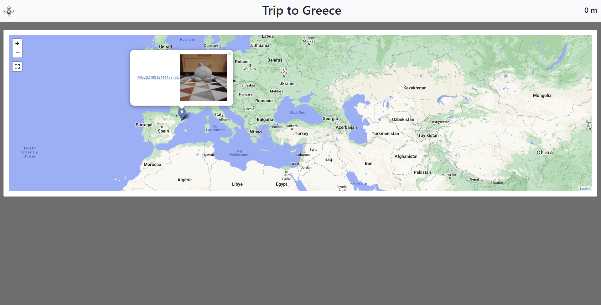

    
# Wanderpi

Keep your best travel memories organized, and your costs to the letter.

[](https://www.youtube.com/watch?v=tdPjDHavmf4) 

Click the thumbnail to watch the video!

Add your trips on the dashboard  |  Organize everything by trip stops or "Albums"
:---: | :---:
  |  


Watch all your images and videos (With location data) |  Control your costs with the Trip Calendar view.
:---: | :---:
  |  

Show all your photos with the slide view |  Watch them all scattered arround the globe (WIP)
:---: | :---:
  |  

## Features

- Upload your photos and videos of your trip or even record ones from the UI, they can be all organized, downloadable at the same quality to share with your friends and family. Stop wasting the internet while traveling sending your photos through WhatsApp and other apps.

- Watch them all scattered around the earth globe, as wanderpi detects where your best memories were taken from.

- Organizing a trip is hard right? Not with wanderpi, simply create a new trip and a calendar will appear for you where you can write down your costs, and write notes! Handy, right?

- Wanna amaze your friends? Show them your photos and videos with the slide mode!

- Download images, edit their names, or click to download videos ready to present to your best friends with all the best photos and videos from your trip.

- Mobile responsive, raspberry pi best fit, you can take wanderpi with you everywhere (It can run without internet).


  
<!-- ## Tech Stack

**Client:** Bootstrap 

**Server:** Flask, Jinja2 Templates and SQLAlchemy. -->

## How to install?

## Installing

It is very easy, and there are different ways from click to install one's to more advanced ones, in case you want to install it from source.
(Docker image coming soon)


### Mac OS
[Manual Installation](https://github.com/elblogbruno/wanderpi#manual-installation) Or you can run the Linux script down here.

### Linux
To install the python server, fire up your Linux or Mac OS distributed machine and run this command.

```
wget https://raw.githubusercontent.com/elblogbruno/wanderpi/master/setup.sh && sudo sh setup.sh
```
That's it.


### Windows

[Manual Installation](https://github.com/elblogbruno/wanderpi#manual-installation)


### Manual installation

Instead, you can follow the steps down here:

- Step 1. Simply clone this repo.
```
git clone https://github.com/elblogbruno/wanderpi
```
- Step 2. Install requirements for python server.
```
cd wanderpi && pip install -r requirements.txt
```
- Step 3. Run the server.
```
python server.py \\Python 3.5 to versions 3.8 supported.
```


## Acknowledgements

 - [flask-video-streaming-recorder](https://github.com/Kr1s77/flask-video-streaming-recorder/tree/master/controller)

## Feedback

If you have any feedback, please reach out me at me@brunomoya.com

  
