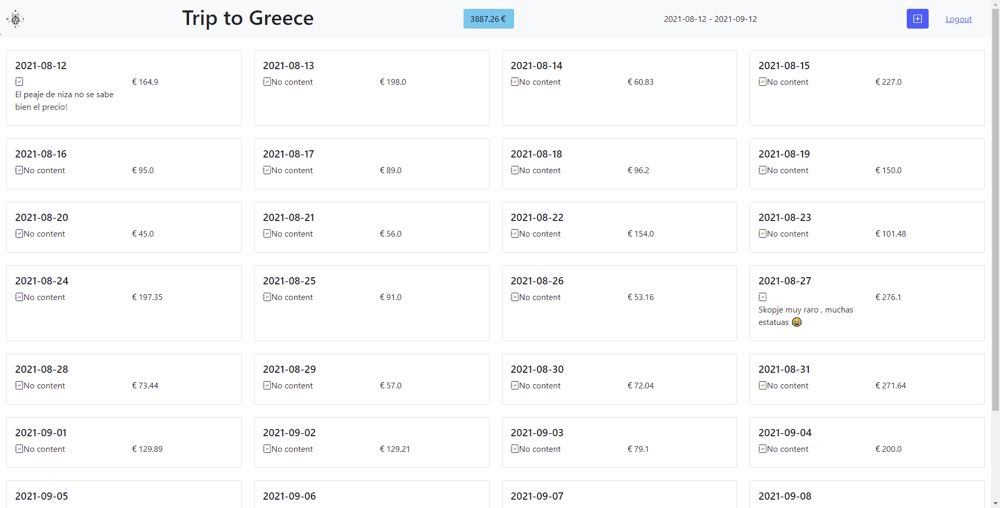

    
# Wanderpi

Keep your best travel memories organized, and your costs to the letter.

## Features

- Upload your photos and videos of your trip or even record ones from the UI, they can be all organized, downloadable at the same quality to share with your friends and family. Stop wasting the internet while traveling sending your photos through WhatsApp and other apps.

- Watch them all scattered around the earth globe, as wanderpi detects where your best memories were taken from.

- Organizing a trip is hard right? Not with wanderpi, simply create a new trip and a calendar will appear for you where you can write down your costs, and write notes! Handy, right?

- Wanna amaze your friends? Show them your photos and videos with the slide mode!

- Download images, edit their names, or click to download videos ready to present to your best friends with all the best photos and videos from your trip.

- Mobile responsive, raspberry pi best fit, you can take wanderpi with you everywhere (It can run without internet).
  
## Screenshots

  
## Tech Stack

**Client:** Bootstrap 

**Server:** Flask, Jinja2 Templates and SQLAlchemy.

## How to install?

Coming soon....

## Acknowledgements

 - [flask-video-streaming-recorder](https://github.com/Kr1s77/flask-video-streaming-recorder/tree/master/controller)

## Feedback

If you have any feedback, please reach out me at me@brunomoya.com

  
